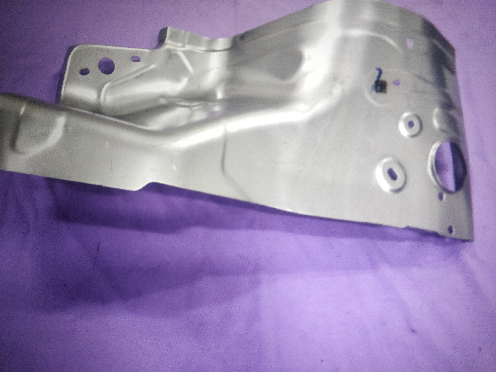
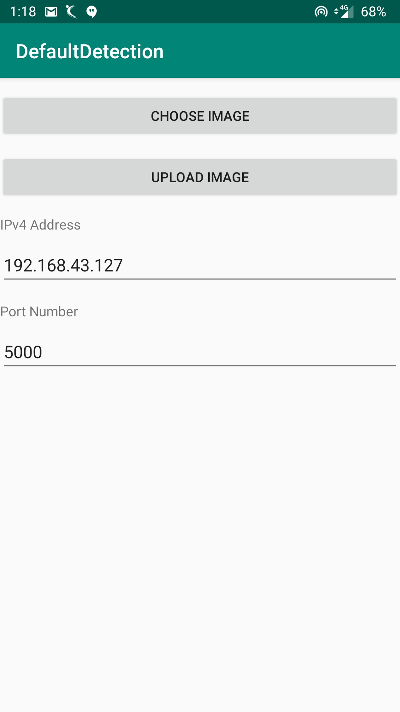
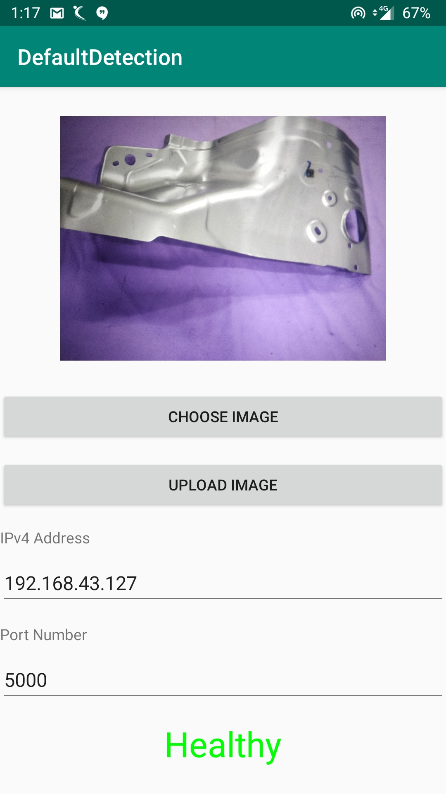
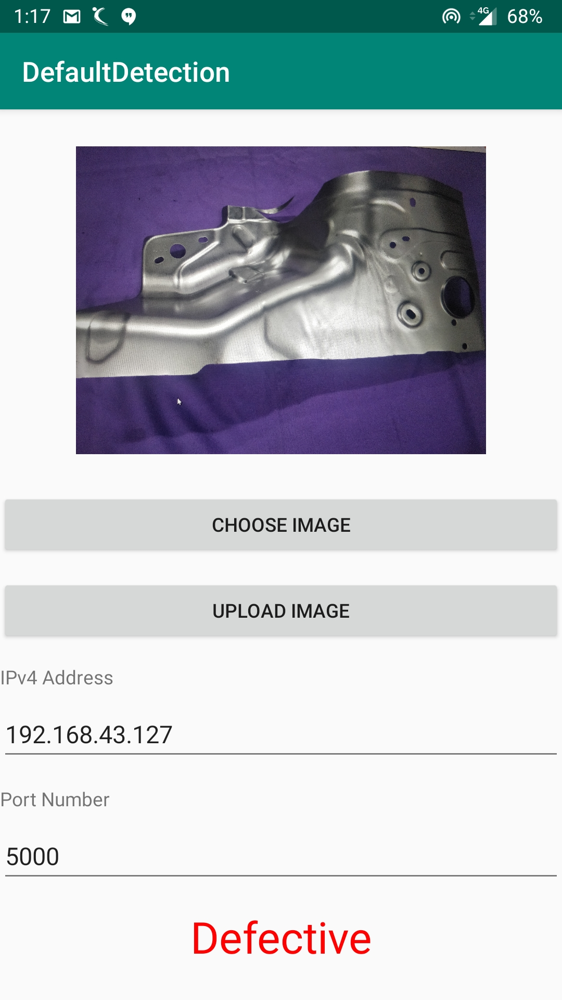

# Fault-Detector

## Problem Statement 
The problem was to detect whether the machine part is healthy or defective.

Healthy Part                | Defective Part
:--------------------------:|:---------------------------
|

---
## Directory Structure
1. **Android-App-Client** - Android Code for the client app through which an image can be uploaded to the server and get the prediction results for whether the part is healthy or defective.
2. **DL Modelling** - Contains 2 of the experiments of deep learning models.
3. **Flask-Web-Server** - Contains Python Flask Server Code which can be run on any local machine.
---
## Android App Setup
App Apk can be downloaded from [here](https://github.com/u-prashant/Fault-Detector/blob/master/app-debug.apk)

Home Screen                |  Healthy Part             | Defective Part 
:-------------------------:|:-------------------------:|:----------------------
||

---
## Flask Server Setup
```
1. git clone https://github.com/u-prashant/Fault-Detector.git
2. cd Fault-Detector/Flask-Web-Server/DefectDetector
3. export FLASK_APP=crack_detector.py
4. flask run --host=$IP_ADDR
```
**Note**
1. $IP_ADDR should be replaced with your ip address.
2. For running the server, it is assumed the `flask` is already installed.
---
## Modelling Experiments

The dataset was very very small for any model to be trained upon especially if we are trying with deep learning models. There were approx 100 images of each class 
(defective/healthy) which is very less and hence, a good accuracy cannot be expected. So, the first approach was to develop a some baseline model as a starting point and to check the accuracy we can get.

### Model 1 (Conv2D)
**Architecture** <br/>
There were layers Convolutional layers with 32, 32, 64 neurons in the respective layers. After that there was one layer of Flatten followed by 1 dense layer and dropout layer (to avoid overfitting) and the output layer with only one neuron as it is a binary classification. <br/><br/>
**Results** <br/>
The training accuracy came out to be around 65% and testing accuracy was about approx 50% with different hyperparameters configuration (around 3 experiments were performed with different hyperparameters). The model is very poor as 50% accuracy is as good as a random guess. <br/>

### Model 2 (Pretrained VGG16 Model + Custom Layers on Top)
As the dataset for training was not sufficient, I thought of trying some pretrained model (VGG16). <br/><br/>
**Architecture**
* Output from the pretrained VGG16 model was fed into the custom layers.
* The custom layers were Flatten, Dense(256), Dropout and the output layer. These layers were added to make pretrained model compatible with our usecase.

<br/> **Results**
The results were better than the previous model. But it had larger no of parameters and hence, more computation will be required during realtime prediciton. The model was actually overfitting.

### Model 3 (Model 2 + Some Image Processing)
Tried various image augmentation techniques so as to avoid overfitting. Tried custom data generator from the existing data. Zoom out/in/image flipping/cropping were tried but the model failed more miserably. I manually went through the images and found out that the many images are taken randomnly so cropping and zoom out/in can remove the most important part of the image i.e. the cracked part. So, it cannot be used.


### Overall Analysis and Feedback
1. Out of the all the experiments that were performed, Model 2 was kind of decent and currently, it is being used at the server side for crack detection.
2. If the plan is to automatically detect the cracks through image processing by the camera that is put above the belt where parts are being moved. Then, we can collect all the images from the camera angle, this way we can preprocess the image as well as generate artificial data for training by using various augmentation techniques like cropping or zooming and can avoid overfitting as well.
3. There is a lot of scope in improving the results by trying other models or going through research papers of those who have already built models similar to this usecase.
